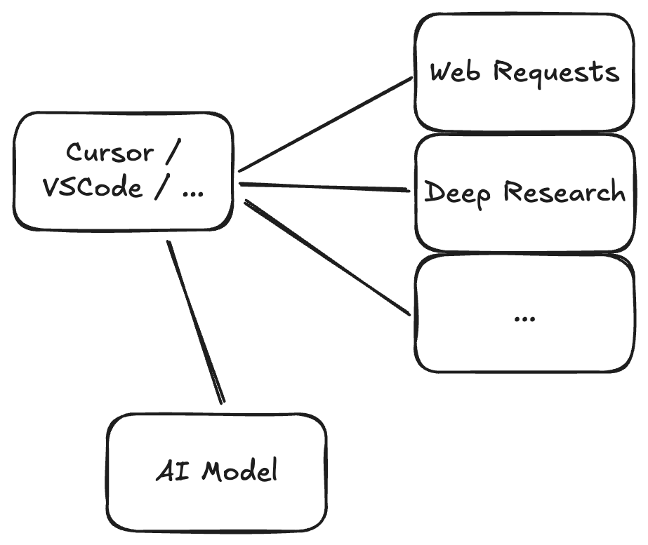
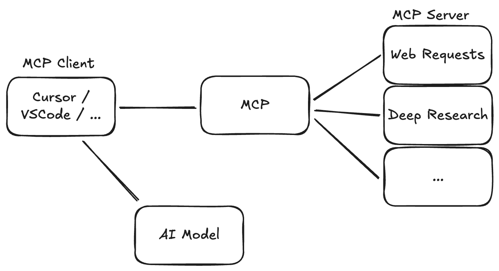

# Tech Talk MCP Server

## Without MCP



Tools like Cursor, VSCode implement features like web requests to provide context to the AI models.

Two large issues:
* Different tools have different features
* Tool maintainer needs to support features

## With MCP

Tools = MCP Client
Features = MCP Server



The tools only know how to use MCP Servers. The MCP Servers provide functionalities.

Advantages:
* A lot of functionalities can be used with every tool
* The maintainer of functionalities can provide MCP server, indepent of tool 

# Example Postgres

```
Look at the posgres database via mcp server postgres and create a `database.md` file with the relational database model using mermaid.

Also make a markdown table with the first row of each table.
```

# Example n8n Workflow

https://n8n.io/

# Build own MCP Server

https://modelcontextprotocol.io/quickstart/server#node
